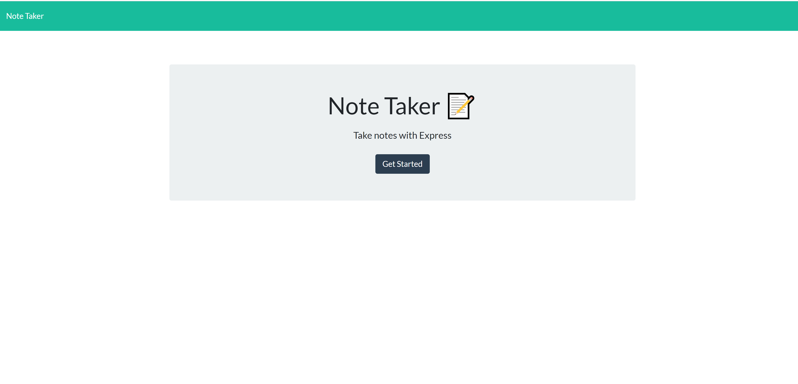

# Note Taker App Week 11

## Description

The goal of this project is to provide the user with an application that allows them to take notes on. Once the user has created a note it will then be persistent in the database. The user is also able to view or delete previous notes.

## Table of Contents

* [Installation
  ](#installation)  

* [Usage
  ](#usage)

* [License
  ](#license)

* [Contributing
  ](#contributing)

* [Example
  ](#example)

* [Questions
  ](#questions)

## Installation

To install necessary dependencies, run the following command:

'''
npm i 
'''

## Usage

After the user has navigated to the main page, they will need to click the "Get Started" button. They will then need to enter text in the "Note title" and "Note Text" text areas. Once both text areas contain information a floppy disc image will appear on the top right side of the page. Once the user clicks on it, their note will be saved and the title will be displayed on the left hand side of the page. When the user clicks on a saved note, the note will show on the right side with the title and text. The user can also click on the trash can button next to a notes title to delete it. If the user wants to create a new note they can click on the plus button on the top right hand side of the page, and a blank new note will appear for the user to enter their information into.

## License

This project is licensed under the MIT license.

## Contributing

The best way to contact me is through email.

## Example

This example demonstrates what the page looks like on first load:

This example demonstrates what the note page looks like:

This example demonstrates after the user has typed in a note title and note text, the save button appear on the top right side of the page:

This example demonstrates what the page looks like when the user clicks on a previously saved note:

This example demonstrates that the user is able to delete saved notes:

## Questions

If you have any questions about the repo, open an issue or contact me directly at Nilesquackmeister@gmail.com. You can find more of my work at [NilesHachmeister](https: //github.com/NilesHachmeister/).